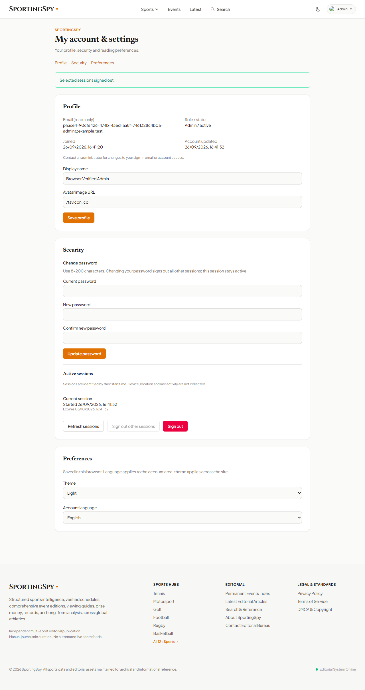
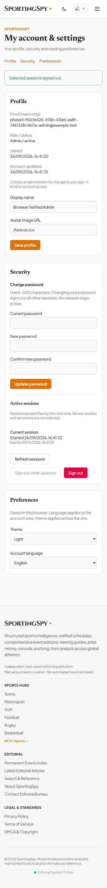

# PHASE 4 STATUS

COMPLETE — implemented and verified locally on 2026-09-26. This is not a deployment or a claim that all future production work is complete.

## Implemented

- `/account` supports authenticated Reader, Author, Editor and Admin accounts, with a sign-in form for anonymous visitors.
- Shows the user's name, email, role, status, joined date, account update date and linked author information.
- Self-service edits allow `name`, `avatar`, and linked `authorProfile.name`, `authorProfile.bio`, `authorProfile.avatar`. Nested ownership, role, status, identity, email and arbitrary fields are rejected. Public author edits are explicitly labeled as public.
- Email remains read-only: it is the login identifier, and this checkout has no verified email-change infrastructure. Existing administrator account management remains separate.
- Password changes verify the current password, enforce the existing 8–200 character policy, require confirmation, use the existing scrypt implementation, and atomically revoke every other session while preserving the current session.
- Database row locks coordinate password changes, login and self-service session mutations. Login rechecks the credential version after acquiring the lock; account mutations recheck that the current session is still active. Security changes and their account audit events commit together.
- Active session list shows creation and expiry timestamps and the current-session indicator. Individual revocation, revocation of all other sessions and current-session logout work.
- Session references are domain-separated SHA-256 digests of random session IDs. Raw session IDs are bearer credentials and are never returned by session-list APIs. References cannot authenticate.
- The existing rate-limit factory enforces password changes at 5 attempts per 15 minutes, profile updates at 30 per minute, and revocations at 20 per minute, all keyed to authenticated user ID. These limits include failed attempts.
- English/Bangla account UI and the existing site-wide light/dark theme persist in browser storage. The inspected source had no existing language-switching architecture; translation is explicitly limited to the account area. These are browser preferences, not server-synchronized account fields.
- Responsive forms use labels, password autocomplete, loading/disabled states and accessible success/error messages. Account access is available from the authenticated header menu and inside the CMS.
- Logout clears local identity only after server success. Unauthorized responses clear authenticated caches; generation counters prevent old requests from restoring private data. Session checks on focus and every 60 seconds detect expiry/role changes. Logout broadcasts to other tabs.

### Related hardening found during inspection

- `/api/data` previously returned the staff directory and audit log to anonymous visitors. Staff directory data is now Admin-only; audits are Admin/Editor-only; unapproved comments are limited to moderators or their submitting user. Existing published/draft article rules are preserved.
- Several CMS PUT routes previously accepted Prisma relation objects directly. A whitelist for nine existing resource types now rejects relation writes and primary-key changes, preventing nested writes from modifying account privileges. Case-insensitive and trailing-slash route variants are covered.
- API responses use `Cache-Control: no-store` after the global security checks.
- Unexpected request errors no longer serialize Prisma/parser errors into logs or responses, where sensitive input could appear. Logs retain the error class; responses use generic messages.
- Malformed cookie encoding is ignored instead of throwing during cookie parsing.
- `/admin` retains the existing `AdminAccessGate`; no public header/footer Admin navigation was added.

## API Changes

| Method | Endpoint | Change |
| --- | --- | --- |
| GET | `/api/auth/me` | Explicit safe self-profile projection, including linked author; existing `requireAuth`, real session required |
| PATCH | `/api/auth/me` | Strict self-profile updates |
| POST | `/api/auth/change-password` | Current-password verification, password update and other-session revocation |
| GET | `/api/auth/sessions` | Safe metadata for the caller's active sessions |
| DELETE | `/api/auth/sessions/:reference` | Owner-scoped individual revocation; current revocation also expires the cookie |
| POST | `/api/auth/sessions/revoke-others` | Revoke all other sessions; accepts `{}` |
| POST | `/api/auth/logout` | Transactional session removal/audit; matching cookie clearing retained |
| POST | `/api/auth/login` | Credential recheck under account lock before session issuance |
| GET | `/api/data` | Staff/audit/comment privacy restrictions |
| PUT | Existing article/sport/event/edition/author/comment/redirect/media/ad routes | Accepted-field whitelists prevent Prisma nested-write injection |

All account mutations pass through the existing global CSRF protection. No duplicate settings endpoint was created for browser-only preferences.

## Database Changes

None. No fields, models or migrations were added. Existing User, Author, Session and AuditLog models cover the implementation. Session references are computed, not stored. No Prisma reset, db push, table/database drop or truncation was used.

## Security Verification

`server/scripts/verify-phase4.ts` passed **24 verification groups** against a separately started production-mode server connected to the local PostgreSQL database. Groups contain multiple HTTP/database/browser assertions.

Verified:

1. Unauthenticated account reads and mutations rejected.
2. All four roles can sign in and read only their profile; safe projection/no-store behavior.
3. Current-session indication, no raw session tokens, references cannot authenticate.
4. Missing and incorrect CSRF rejected on profile/password/revocation/logout routes.
5. Valid-CSRF profile and linked author updates persist, including Bangla text.
6. Invalid types, unknown/sensitive fields, role/status/email/ID changes and oversized bodies rejected.
7. Other-user writes, self-role escalation and forged identity headers rejected.
8. Wrong/missing current password, weak new password and confirmation mismatch rejected; successful change uses scrypt, old login fails, new login works, other sessions fail while the current session survives.
9. Password rate limiting and Retry-After.
10. Individual/bulk session revocation; foreign and nonexistent references return the same not-found response.
11. Current-session revocation and logout remove database sessions; replay fails; production clearing cookies retain Path, HttpOnly, SameSite and Secure attributes.
12. Expired-session and inactive-user rejection.
13. Public/staff data separation and audit RBAC.
14. Production headers, allowed/denied CORS origins and preflight.
15. Nested CMS relation writes rejected, including mixed-case/trailing-slash requests.
16. Author article creation/edit, Reader denial, anonymous draft filtering and Admin deletion.
17. Legitimate writes still work across all nine hardened CMS resource types.
18. Concurrent old-password login cannot leave a surviving session after password change; simultaneous password changes serialize with one succeeding and the stale one failing.
19. Profile/revocation limits and existing failed-login limit.
20. Security audit events exist; passwords, hashes, session secrets and CSRF tokens absent from audit content; credential values absent from captured server logs.
21. Browser-simulated logout failure keeps authenticated UI; browser revocation invalidates another session.
22. Browser sign-in, profile save/reload, theme/Bangla preference persistence, and 390px mobile layout without horizontal overflow.
23. Admin gate, account navigation, successful logout and cross-tab clearing.
24. Reader denied CMS access, revoked-session UI returns to sign-in, no public Admin links and no browser JavaScript errors.

Password change behavior was verified through the real HTTP API and PostgreSQL, not merely by inspecting component code. Preferences were tested in the browser, since they intentionally have no settings API.

## Regression Verification

Login/logout, server sessions, role enforcement, Admin gate, public/Admin boundary, CSRF, rate limiting, CORS, production headers, audit logging and editorial CRUD checks passed. Every existing row was compared after fixture cleanup.

Browser testing used installed Chrome through a cached Playwright package. The in-app browser tool failed during bootstrap with an environment `sandboxPolicy` error, before opening a tab. An attempted local Playwright dev-dependency installation also encountered the existing Vite/esbuild peer-dependency conflict; the dependency graph was left unchanged and cached Playwright was used instead.

## Build / TypeScript

| Check | Result |
| --- | --- |
| `npx tsc --noEmit` | PASS, exit 0 |
| `npm run build` | PASS, exit 0; final JS 496.00 kB / gzip 126.36 kB |
| `npx prisma validate` | PASS |
| `npx prisma migrate status` | PASS; 2 migrations, database up to date |
| `npm run test:phase4` with `PLAYWRIGHT_MODULE` supplied | Underlying verifier passed 24 groups including browser checks, exit 0 |

The final verifier invocation was `npx tsx server/scripts/verify-phase4.ts`; `test:phase4` is an alias for that same command. Build retains the pre-existing Vite warning about `__dirname` and its future native config loader.

## Database Integrity

Both counts and full-row SHA-256 digests were identical before and after final verification for all 12 application tables:

| Table | Before | After |
| --- | ---: | ---: |
| Sport | 13 | 13 |
| SportEvent | 5 | 5 |
| EventEdition | 6 | 6 |
| Article | 10 | 10 |
| Author | 4 | 4 |
| User | 4 | 4 |
| Session | 11 | 11 |
| Comment | 9 | 9 |
| MediaItem | 5 | 5 |
| AdSlotConfig | 9 | 9 |
| RedirectRule | 3 | 3 |
| AuditLog | 52 | 52 |

Only UUID-scoped disposable test users, their sessions, their test author/article and test-generated audit records were removed. An initial fixture email-normalization mistake generated one unknown-user login audit; it was identified by its exact generated email and record ID and removed separately. No pre-existing row was removed or changed. The retained verification script creates new unique fixtures on each run and cleans them in `finally`.

`PROJECT_BRAIN.md` and historical `data/db.json` remained untouched; their file hashes also matched. Migration status was checked before implementation and after verification work; no migration was needed.

## Files Changed

- `server/account.ts` — self-service account routes, validation, locks, limits and audit events.
- `server/cmsFields.ts` — existing CMS accepted-field boundaries.
- `server.ts` — route integration, login/logout coordination, data privacy, cache and error handling.
- `server/session.ts` — malformed-cookie handling.
- `src/pages/AccountPage.tsx` — account/profile/security/preferences UI.
- `src/context/AppContext.tsx` — preferences, API integration, logout/session/cache lifecycle.
- `src/types/index.ts` — safe account/session frontend types.
- `src/App.tsx` — `/account` route.
- `src/components/layout/Header.tsx` — authenticated account menu entry.
- `src/components/admin/AdminLayout.tsx` — My account link.
- `server/scripts/verify-phase4.ts` — repeatable functional/security/browser/integrity verification.
- `package.json` — `test:phase4` command.
- `verification/phase4-account-desktop.png`, `verification/phase4-account-mobile.png` — browser evidence using disposable test data.
- `PHASE4_IMPLEMENTATION.md` — this report.

## Re-running Verification

Build first, then run `npm run test:phase4`. The script rejects nonlocal/production-named database URLs, refuses to run when scheduled articles are due within ten minutes, launches its own server on an available port, and validates integrity after removing only its fixtures. Run against an idle local database; unrelated simultaneous changes deliberately cause integrity verification to fail.

For browser coverage, provide `PLAYWRIGHT_MODULE` as the absolute path to an installed or cached Playwright `index.mjs` and use installed Chrome (default), or select another installed channel with `TEST_BROWSER_CHANNEL`. Without that variable, the script explicitly reports browser checks as skipped. No Playwright production dependency was added.

## Known Limitations

- Rate limits are in-process; they reset on restart and are not shared across instances.
- Theme/language preferences are per browser, not per-user cross-device settings. Account labels and normal feedback are bilingual; server validation errors and the wider site remain English.
- Email changes are not self-service. Existing password-reset, email-verification and MFA infrastructure is still absent.
- Session metadata is limited to the existing creation/expiry fields. No IP, device or last-activity tracking was added. Session listing/revocation scans only that user's sessions; it is not paginated.
- Avatar editing accepts image references, not uploads. Production CSP still limits remote images to the existing allowed host; arbitrary external images may be blocked.
- Session expiry is reflected on the next protected request, window focus or periodic check, not via server push.
- The existing Vite/esbuild peer-dependency installation conflict and config warning are not resolved by Phase 4.
- Local verification does not establish deployment, HTTPS reverse-proxy behavior, load capacity or distributed rate limiting.

## Next Recommended Phase

The recorded roadmap labels **Phase 5 — Monetization**, but its earlier phase labels are stale (it calls Phase 4 media infrastructure). Reconcile that roadmap separately before treating its numbering as the current plan. With accounts implemented, the immediate production-readiness follow-up is verified account recovery/email flows, deployment checks and a shared rate-limit store if multiple instances are planned. Media upload/storage remains separate unfinished work. No ad-network integration should be inferred as authorized by this implementation.

## Browser Evidence

